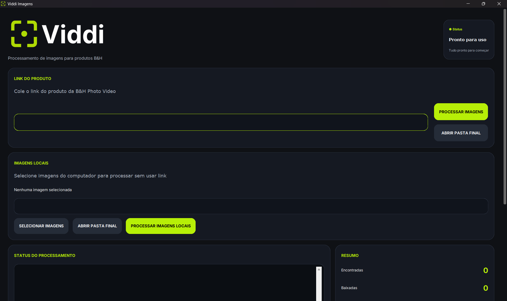

# Viddi Imagens

Desktop application built with Python for automating audiovisual product image processing workflows.

## Features

- Automatic image download from B&H Photo Video
- Local image processing
- Modern desktop UI using CustomTkinter
- Automatic folder organization
- Real-time logs and progress tracking
- Windows executable generation (`.exe`)

## Technologies

- Python
- CustomTkinter
- Playwright
- Pillow (PIL)
- PyInstaller

## Run Project

```bash
pip install -r requirements.txt
py -m playwright install chromium
py -m app.main
```
<<<<<<< HEAD

=======
>>>>>>> 5c811166537e4ca5d8618dc4e7c1ffebe90a0e00
## Build Executable

```bash
py -m PyInstaller --noconfirm --windowed --name "Viddi Imagens" --icon "assets/icon.ico" --add-data "assets;assets" --collect-all customtkinter --collect-all playwright app/main.py
```
<<<<<<< HEAD

## Preview

### Main Interface


## Author

Matheus Andrade
=======
>>>>>>> 5c811166537e4ca5d8618dc4e7c1ffebe90a0e00
